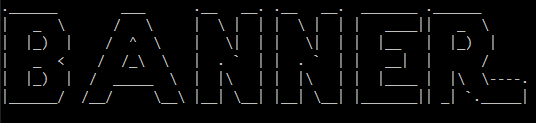

<p align="center">
  
</p>
<p align="center">
  
  
  
  
  
</p>

<p align="center">
  
  
  
  
</p>

<br><br><br>

<h1 align="center">Banner</h1>

## Description

```
use a banner for your scripts. this script uses random font every time you execute it.
```

## Features
- easy 2 use
- use plenty fonts

## Installation

```
git clone https://github.com/kevin99l/banner
cd banner
pip install -r requirements.txt
```

## How to use


<br><br>

### Written in


<br><br>

### Used


#

> please hit the 🌟 if it was useful.

> how to reach me : [](mailto:kevin.l619.kl@gmail.com)
[](https://t.me/kevindotl)

<br>

### Instagram Page
<a href="https://instagram.com/python_programming619"></a>

#

